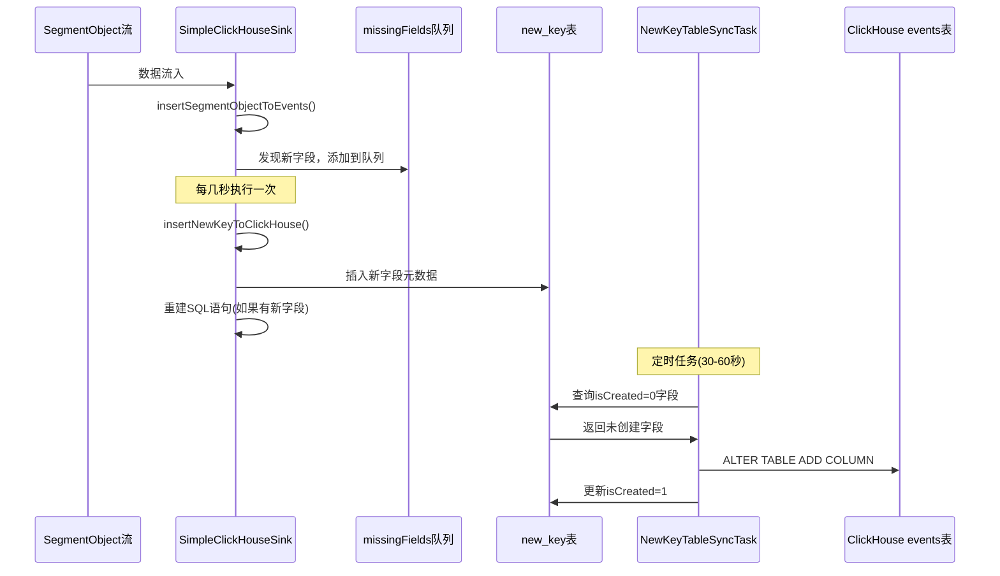

# ClickHouse 动态表结构更新机制

## 概述

本文档详细描述了基于 Flink + ClickHouse 的流处理系统中动态表结构更新机制的实现原理、执行流程和关键组件。该机制能够在不停机的情况下，自动识别新字段并动态扩展 ClickHouse 表结构，确保系统能够适应不断变化的数据 schema。

## 系统架构图

```
┌─────────────────┐    ┌──────────────────┐    ┌─────────────────┐
│  SegmentObject  │───→│ SimpleClickHouse │───→│ ClickHouse DB   │
│  数据流入       │    │ Sink             │    │ events 表       │
└─────────────────┘    └──────────────────┘    └─────────────────┘
                              │
                              ↓
                       ┌──────────────────┐
                       │ missingFields    │
                       │ 缺失字段队列     │
                       └──────────────────┘
                              │
                              ↓ (每几秒执行一次)
                       ┌────────────────────────┐
                       │insertNewKeyToClickHouse│
                       │ 字段记录方法           │
                       └────────────────────────┘
                              │
                              ↓
                       ┌──────────────────┐    ┌─────────────────┐
                       │ new_key 表       │←───│NewKeyTableSync  │
                       │ 字段元数据存储   │     │Task 定时任务    │
                       └──────────────────┘    └─────────────────┘
                              │
                              ↓ (定时扫描)
                       ┌──────────────────┐
                       │ ALTER TABLE      │
                       │ 动态添加列       │
                       └──────────────────┘
```

## 核心组件

### 1. SimpleClickHouseSink - 数据写入和字段发现

**职责**: 负责将 SegmentObject 数据写入 ClickHouse，并发现新字段

**关键属性**:
```java
// 全局共享的缺失字段队列，线程安全
static ConcurrentSkipListSet<String> missingFields = new ConcurrentSkipListSet<>();
```

**执行流程**:

#### 1.1 数据写入阶段 (invoke 方法)
```java
public void invoke(SegmentObject segmentObject, Context context) throws Exception {
    // 调用核心插入方法
    insertSegmentObjectToEvents(segmentObject);
}
```

#### 1.2 字段发现阶段 (insertSegmentObjectToEvents 方法)
```java
private void insertSegmentObjectToEvents(SegmentObject segment) throws SQLException {
    // 在构建 INSERT 语句过程中，发现表中不存在的字段
    // 将缺失字段添加到队列中
    missingFields.add("tag_user_id_type_String");
    missingFields.add("metric_response_time_type_Int64");
    // ... 其他缺失字段
}
```

**字段命名规范**:
- 格式: `{fieldName}_type_{ClickHouseType}`
- 示例: 
  - `tag_user_id_type_String`
  - `metric_response_time_type_Int64`
  - `log_level_type_String`

### 2. 定期字段处理机制 (insertNewKeyToClickHouse)

**执行频率**: 每隔几秒执行一次（可配置）

**主要功能**:
1. 批量处理 `missingFields` 队列中的字段
2. 将新发现的字段信息插入到 `new_key` 表
3. 返回是否有新字段被处理的标志

**执行逻辑**:
```java
private boolean insertNewKeyToClickHouse() throws SQLException {
    boolean hasNewFields = false;
    
    // 1. 取出队列中的所有字段
    Set<String> fieldsToProcess = new HashSet<>(missingFields);
    missingFields.clear();
    
    // 2. 解析字段名和类型
    for (String fieldInfo : fieldsToProcess) {
        String[] parts = fieldInfo.split("_type_");
        String fieldName = parts[0];
        String fieldType = parts[1];
        
        // 3. 插入到 new_key 表
        String sql = "INSERT INTO new_key (keyName, keyType, isCreated) VALUES (?, ?, 0)";
        // ... 执行插入逻辑
        
        hasNewFields = true;
    }
    
    return hasNewFields;
}
```

**返回值处理**:
```java
// 如果有新字段被处理，需要重建 SQL 语句
if (insertNewKeyToClickHouse()) {
    // 重新构建 INSERT 语句，包含新字段
    rebuildInsertStatement();
}
```

### 3. new_key 表结构

**表作用**: 存储新发现字段的元数据信息

**表结构**:
```sql
CREATE TABLE new_key (
    keyName String,        -- 字段名称
    keyType String,        -- 字段类型 (ClickHouse 类型)
    isCreated UInt8        -- 是否已创建 (0=未创建, 1=已创建)
) ENGINE = MergeTree()
ORDER BY keyName;
```

**数据示例**:
```
┌─keyName─────────────────┬─keyType─┬─isCreated─┐
│ tag_user_id             │ String  │         0 │
│ metric_response_time    │ Int64   │         0 │
│ log_level              │ String  │         1 │
└─────────────────────────┴─────────┴───────────┘
```

### 4. NewKeyTableSyncTask - 全局定时同步任务

**职责**: 定期扫描 `new_key` 表，执行实际的表结构修改

**执行频率**: 可配置，建议 30-60 秒

**核心方法**:
```java
void syncNewKeys() throws Exception {
    // 1. 查询未创建的字段
    String selectSql = "SELECT keyName, keyType FROM new_key WHERE isCreated = 0";
    
    // 2. 为每个字段执行 ALTER TABLE
    for (每个未创建字段) {
        String alterSql = String.format(
            "ALTER TABLE %s.%s ADD COLUMN IF NOT EXISTS %s Nullable(%s)",
            schema, table, keyName, keyType);
        
        // 执行 DDL
        statement.execute(alterSql);
    }
    
    // 3. 更新字段状态为已创建
    String updateSql = "UPDATE new_key SET isCreated = 1 WHERE keyName = ?";
    // ... 批量更新
}
```

## 完整执行流程

### 阶段 1: 数据写入和字段发现

```sequence
SegmentObject->SimpleClickHouseSink: invoke(segmentObject)
SimpleClickHouseSink->SimpleClickHouseSink: insertSegmentObjectToEvents()
SimpleClickHouseSink->missingFields: add("tag_new_field_type_String")
Note right of missingFields: 字段被添加到全局队列
```

### 阶段 2: 定期字段处理

```sequence
Timer->SimpleClickHouseSink: 每几秒触发
SimpleClickHouseSink->SimpleClickHouseSink: insertNewKeyToClickHouse()
SimpleClickHouseSink->new_key表: INSERT新字段元数据
SimpleClickHouseSink->SimpleClickHouseSink: rebuildInsertStatement()
Note right of SimpleClickHouseSink: 如果有新字段则重建SQL
```

### 阶段 3: 表结构同步

```sequence
NewKeyTableSyncTask->new_key表: 查询isCreated=0的字段
new_key表->NewKeyTableSyncTask: 返回未创建字段列表
NewKeyTableSyncTask->ClickHouse: ALTER TABLE ADD COLUMN
NewKeyTableSyncTask->new_key表: UPDATE isCreated=1
```

## 时序图



## 配置参数

### SimpleClickHouseSink 配置
```yaml
clickhouse:
  batch:
    size: 100                    # 批量写入大小
    interval: 5000              # 批量写入间隔(毫秒)
  field_check_interval: 3000    # 字段检查间隔(毫秒)
```

### NewKeyTableSyncTask 配置
```yaml
sync:
  interval: 60000               # 同步间隔(毫秒)
  enabled: true                 # 是否启用同步任务
```

## 性能特征

### 优势
1. **非阻塞**: 字段发现和处理异步进行，不影响主数据流
2. **批量处理**: 减少数据库操作频率，提高性能
3. **容错性**: 单个字段创建失败不影响其他字段
4. **幂等性**: 使用 `IF NOT EXISTS` 确保操作安全

### 性能指标
- **字段发现延迟**: 实时（数据写入时发现）
- **字段记录延迟**: 几秒（可配置）
- **表结构同步延迟**: 30-60秒（可配置）
- **内存占用**: 低（队列大小受限于新字段数量）

## 监控和告警

### 关键指标
1. **missingFields 队列大小**: 监控积压情况
2. **new_key 表未创建字段数量**: `SELECT COUNT(*) FROM new_key WHERE isCreated = 0`
3. **字段创建成功率**: 监控 DDL 操作失败率
4. **同步任务执行频率**: 确保定时任务正常运行

### 告警规则
```yaml
alerts:
  - name: MissingFieldsBacklog
    condition: missingFields.size() > 100
    severity: WARNING
    
  - name: SyncTaskFailed
    condition: sync_task_failure_rate > 0.1
    severity: CRITICAL
    
  - name: UnprocessedFields
    condition: unprocessed_fields_count > 50
    severity: WARNING
```

## 故障排查

### 常见问题

#### 1. 字段创建失败
**现象**: 日志显示 "Failed to add column"
**排查**:
- 检查 ClickHouse 连接状态
- 验证用户是否有 ALTER 权限
- 检查字段名是否符合 ClickHouse 命名规范

#### 2. 同步任务停止
**现象**: new_key 表中 isCreated=0 的记录不断增加
**排查**:
- 检查 NewKeyTableSyncTask 是否正常运行
- 查看任务执行日志
- 验证定时器配置

#### 3. SQL 重建频繁
**现象**: 频繁的 "rebuildInsertStatement" 日志
**排查**:
- 检查 missingFields 队列积压情况
- 调整 field_check_interval 参数
- 分析新字段产生频率

## 最佳实践

### 1. 参数调优
- **生产环境**: `field_check_interval: 5000ms`, `sync_interval: 60000ms`
- **测试环境**: `field_check_interval: 3000ms`, `sync_interval: 30000ms`
- **开发环境**: `field_check_interval: 1000ms`, `sync_interval: 10000ms`

### 2. 监控设置
- 设置 missingFields 队列大小告警
- 监控 new_key 表增长趋势
- 跟踪字段创建成功率

### 3. 运维建议
- 定期清理 new_key 表中的历史记录
- 备份重要的表结构变更日志
- 在业务低峰期执行大批量字段创建

## 总结

该动态表结构更新机制通过三层架构（字段发现 → 元数据记录 → 表结构同步）实现了 ClickHouse 表的无停机动态扩展。系统具有良好的性能、容错性和可维护性，能够适应不断变化的数据 schema 需求。
