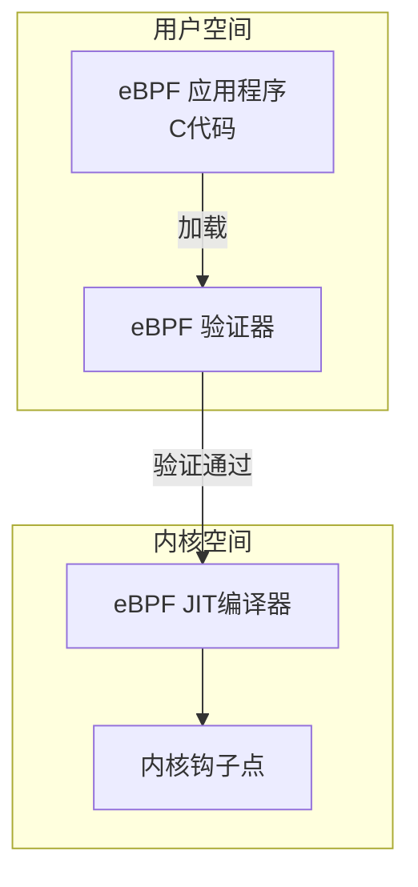

# Markdown 表格对齐解决方案

## 问题说明

在 Markdown 中使用文本绘制的表格或图表时，中英文混合会导致对齐问题：

**问题示例：**
```
┌─────────────┐
│   中文内容   │  <- 中文占用更多视觉宽度
│   English   │  <- 英文对齐正常
└─────────────┘
```

## 解决方案

### 方案1：使用标准 Markdown 表格（推荐）

将文本表格转换为 Markdown 表格语法：

```markdown
| 组件名称 | 功能描述 | 部署位置 |
|---------|---------|---------|
| eBPF 程序 | 内核监控 | 内核空间 |
| 监控代理 | 数据收集 | 用户空间 |
| 数据存储 | 指标存储 | 后端服务 |
```

渲染效果：

| 组件名称 | 功能描述 | 部署位置 |
|---------|---------|---------|
| eBPF 程序 | 内核监控 | 内核空间 |
| 监控代理 | 数据收集 | 用户空间 |
| 数据存储 | 指标存储 | 后端服务 |

### 方案2：使用 Mermaid 图表

对于架构图，可以使用 Mermaid：



### 方案3：保持文本图但优化布局

如果必须使用文本图，可以：

1. **使用英文标注**：
```
┌─────────────┐                ┌─────────────────┐
│   eBPF      │                │                 │
│   Program   │  ──load──>     │  eBPF Verifier  │
│   (C code)  │                │                 │
└─────────────┘                └─────────────────┘
```

2. **调整框宽度适应中文**：
```
┌───────────────────┐          ┌───────────────────┐
│   eBPF 应用程序    │          │   eBPF 验证器      │
│   （C 代码）       │ ──加载──> │                   │
└───────────────────┘          └───────────────────┘
```

3. **使用缩写加说明**：
```
┌─────────┐
│  eBPF   │  eBPF: 扩展伯克利包过滤器
│  App    │  App: 应用程序
└─────────┘
```

### 方案4：使用 HTML 表格

在 Markdown 中嵌入 HTML 获得更好的控制：

```html
<table>
<tr>
    <th>组件名称</th>
    <th>功能描述</th>
    <th>部署位置</th>
</tr>
<tr>
    <td>eBPF 程序</td>
    <td>内核监控</td>
    <td>内核空间</td>
</tr>
</table>
```

### 方案5：使用代码块保持原样

对于 ASCII 艺术图，使用代码块可以保证等宽显示：

```
┌─────────────────────────────────────┐
│          Container Host             │
├─────────────────────────────────────┤
│  ┌─────────┐  ┌─────────┐         │
│  │Container│  │Container│         │
│  │    1    │  │    2    │         │
│  └─────────┘  └─────────┘         │
└─────────────────────────────────────┘
```

## 最佳实践建议

1. **数据表格**：使用 Markdown 表格语法
2. **流程图**：使用 Mermaid 或其他图表工具
3. **架构图**：优先使用图片或 SVG
4. **简单示意图**：可以使用优化后的文本图

## 工具推荐

1. **在线表格生成器**：
   - https://www.tablesgenerator.com/markdown_tables
   - https://www.tableconvert.com/

2. **图表工具**：
   - Mermaid Live Editor
   - Draw.io
   - PlantUML

3. **VS Code 插件**：
   - Markdown Table Formatter
   - Mermaid Preview
   - Markdown All in One

通过这些方案，可以在保持文档可读性的同时，解决中文对齐问题。