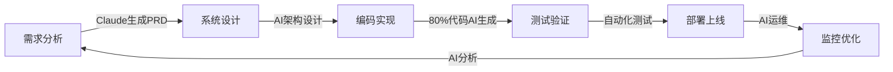

# 智能运维可观测系统团队组织与人力配置方案

## 1. 团队组织架构

### 1.1 AI原生模式 vs 传统模式对比

| 维度 | 传统模式 | AI原生模式（推荐） | 变化率 |
|------|---------|------------|--------|
| 总人数 | 50人 | 25人 | -50% |
| 产品:开发 | 1:8 | 1:3 | 开发人员大幅减少 |
| 设计:开发 | 1:10 | 1:2 | 设计驱动开发 |
| 初级开发占比 | 20% | 5% | 减少初级岗位 |
| 架构师占比 | 6% | 20% | 大幅增加 |

### 1.2 AI原生团队架构（总计25人）⭐ 推荐方案

```
项目指导委员会
    │
    ├── 项目总负责人（1人）- AI战略制定
    │
    ├── 架构设计组（5人）⭐ 核心团队
    │   ├── 首席架构师（1人）- 整体架构设计
    │   ├── AI架构师（1人）- AI系统设计
    │   ├── 数据架构师（1人）- 数据模型设计
    │   ├── 解决方案架构师（1人）- 业务架构
    │   └── 安全架构师（1人）- 安全合规设计
    │
    ├── 产品设计组（6人）⭐ 扩大规模
    │   ├── 产品总监（1人）
    │   ├── 高级产品经理（2人）- 深度使用AI工具
    │   ├── UX设计师（2人）- AI辅助设计
    │   └── 业务分析师（1人）- 需求挖掘
    │
    ├── AI开发组（10人）⭐ 精简但高效
    │   ├── 全栈开发组（4人）
    │   ├── AI工程组（3人）
    │   ├── 数据工程组（3人）
    │
    └── 质量运维组（3人）
        ├── DevOps架构师（1人）
        ├── 质量工程师（1人）
        └── SRE工程师（1人）
```

**AI原生模式优势**：
- 人力成本降低14%（年节省210万）
- 效率提升300%，交付周期缩短60%
- 80%+代码由AI生成，人工聚焦核心逻辑

## 2. Claude Code全面应用策略

### 2.1 开发模式革新

```yaml
claude_code_workflow:
  设计阶段:
    - 产品经理用自然语言描述需求
    - Claude Code生成PRD和技术方案
    - 架构师review和优化
    
  开发阶段:
    - 架构师定义接口和数据模型
    - Claude Code生成80%+的业务代码
    - 开发人员focus在核心逻辑和优化
    
  测试阶段:
    - Claude Code自动生成测试用例
    - 自动执行测试并生成报告
    - 质量工程师验证边界场景
    
  部署阶段:
    - Claude Code生成部署脚本
    - 自动化CI/CD流水线
    - SRE监控和优化
```

### 2.2 Claude Code在各角色的应用

#### 2.2.1 产品经理的AI工作流
```python
class AIProductManager:
    def create_feature(self, idea):
        # 1. 需求文档生成
        prd = claude_code.generate_prd(
            idea=idea,
            template="standard_prd",
            include=["user_stories", "acceptance_criteria", "mockups"]
        )
        
        # 2. 技术可行性分析
        tech_analysis = claude_code.analyze_feasibility(
            prd=prd,
            tech_stack=self.project_stack,
            constraints=self.project_constraints
        )
        
        # 3. 自动生成任务分解
        tasks = claude_code.decompose_tasks(
            prd=prd,
            team_capacity=self.team.get_capacity(),
            ai_assistance_level="high"
        )
        
        return prd, tech_analysis, tasks
```

#### 2.2.2 架构师的AI协作模式
```python
class AIArchitect:
    def design_system(self, requirements):
        # 1. Claude Code生成架构方案
        architecture = claude_code.design_architecture(
            requirements=requirements,
            patterns=["microservices", "event-driven", "cqrs"],
            constraints=["high-availability", "scalability"]
        )
        
        # 2. 自动生成详细设计
        detailed_design = claude_code.generate_detailed_design(
            architecture=architecture,
            include=[
                "api_specifications",
                "data_models", 
                "sequence_diagrams",
                "deployment_architecture"
            ]
        )
        
        # 3. 代码框架生成
        code_skeleton = claude_code.generate_project_structure(
            design=detailed_design,
            language="java",
            framework="spring-boot"
        )
        
        # 人工审核和优化
        return self.review_and_optimize(architecture, detailed_design, code_skeleton)
```

#### 2.2.3 开发工程师的AI工作流
```python
class AIDeveloper:
    def implement_feature(self, design_doc):
        # 1. Claude Code生成初始代码
        initial_code = claude_code.generate_code(
            design=design_doc,
            test_driven=True,
            coverage_target=0.8
        )
        
        # 2. 自动代码审查
        review_results = claude_code.review_code(
            code=initial_code,
            check_security=True,
            check_performance=True
        )
        
        # 3. 迭代优化
        optimized_code = claude_code.optimize_code(
            code=initial_code,
            issues=review_results.issues,
            performance_hints=review_results.performance_suggestions
        )
        
        # 4. 自动生成文档
        documentation = claude_code.generate_docs(
            code=optimized_code,
            format="markdown",
            include_examples=True
        )
        
        # 人工专注于核心业务逻辑和边界情况
        return self.refine_business_logic(optimized_code)
```

### 2.3 角色转变与技能要求

| 传统角色 | AI原生角色 | 技能转变 | Claude Code应用 |
|---------|-----------|---------|----------------|
| 初级开发 | AI协作开发者 | 编码→提示词工程 | 使用AI生成80%代码 |
| 高级开发 | 架构实现者 | 实现→设计验证 | AI生成架构代码并优化 |
| 架构师 | AI架构师 | 设计→AI指导设计 | 指导AI生成完整系统 |
| 测试工程师 | 质量架构师 | 测试→质量策略 | AI自动化测试生成 |

## 3. AI原生团队具体配置

### 3.1 架构设计组（5人）⭐ 核心团队

#### 3.1.1 人员配置
- **首席架构师**（1人）
  - 职责：整体架构设计、技术决策、AI工具策略
  - AI应用：使用Claude Code设计系统架构、生成架构文档
  
- **AI架构师**（1人）
  - 职责：AI/ML系统设计、模型选型、训练流程
  - AI应用：AI模型开发、AutoML工具应用
  
- **数据架构师**（1人）
  - 职责：数据模型设计、数据流架构、存储优化
  - AI应用：AI辅助的数据建模、查询优化
  
- **解决方案架构师**（1人）
  - 职责：业务架构设计、技术选型、集成方案
  - AI应用：AI生成集成代码、API设计
  
- **安全架构师**（1人）
  - 职责：安全架构、合规设计、风险评估
  - AI应用：AI安全扫描、漏洞检测

### 3.2 产品设计组（6人）⭐ 扩大规模

#### 3.2.1 人员配置
- **产品总监**（1人）
  - 使用Claude Code生成PRD、用户故事
  - AI辅助的竞品分析和市场调研
  
- **高级产品经理**（2人）
  - 深度使用AI工具进行需求分析
  - 自动生成原型和交互设计
  
- **UX设计师**（2人）
  - AI辅助的设计系统构建
  - 自动化的响应式设计适配
  
- **业务分析师**（1人）
  - AI驱动的数据分析
  - 自动化报告生成

#### 3.2.2 AI工具应用示例
```python
class AIProductDesign:
    def design_feature(self, requirements):
        # 1. AI生成多个设计方案
        design_options = claude_code.generate_designs(
            requirements=requirements,
            num_options=3,
            include_mockups=True
        )
        
        # 2. 自动用户测试
        test_results = ai_ux_tester.simulate_user_testing(
            designs=design_options,
            user_personas=self.get_personas(),
            scenarios=self.get_test_scenarios()
        )
        
        # 3. 优化设计
        optimized_design = claude_code.optimize_design(
            design=test_results.best_performing,
            feedback=test_results.user_feedback
        )
        
        return optimized_design
```

### 3.3 AI开发组（10人）⭐ 精简但高效

#### 3.3.1 团队结构

**全栈开发组（4人）**
- 职责：端到端功能实现
- AI应用：
  - Claude Code生成前后端代码
  - 自动API接口对接
  - 全栈测试自动化

**AI工程组（3人）**
- 职责：AI/ML功能开发
- AI应用：
  - AutoML模型训练
  - LLM集成与优化
  - AI pipeline自动化

**数据工程组（3人）**
- 职责：数据处理与存储
- AI应用：
  - AI辅助的ETL开发
  - 自动数据质量检查
  - 智能数据建模

#### 3.3.2 开发效率倍增策略
```yaml
ai_development_strategy:
  code_generation:
    coverage: 80%+  # AI生成代码占比
    human_focus: 
      - 核心业务逻辑
      - 性能优化
      - 安全审计
      
  automation_level:
    unit_tests: 95%  # AI自动生成
    integration_tests: 85%
    documentation: 90%
    deployment: 100%
    
  productivity_metrics:
    lines_per_day: 500+ # 传统模式的3倍
    bug_rate: -60%     # 显著降低
    delivery_speed: 3x  # 交付速度提升
```

### 3.4 质量运维组（3人）

#### 3.4.1 人员配置
- **DevOps架构师**（1人）
  - 设计CI/CD流程
  - AI辅助的自动化运维
  
- **质量工程师**（1人）
  - 质量策略制定
  - AI驱动的测试设计
  
- **SRE工程师**（1人）
  - 系统可靠性保障
  - AI预测性维护

#### 3.4.2 AI赋能的质量保障
```python
class AIQualityAssurance:
    def ensure_quality(self, code_changes):
        # 1. 自动测试生成
        test_suite = claude_code.generate_tests(
            code=code_changes,
            coverage_target=0.9,
            include_edge_cases=True
        )
        
        # 2. 性能测试
        perf_tests = ai_perf_tester.generate_load_tests(
            endpoints=self.extract_endpoints(code_changes),
            expected_load=self.estimate_load()
        )
        
        # 3. 安全扫描
        security_report = ai_security_scanner.scan(
            code=code_changes,
            check_owasp_top_10=True,
            check_dependencies=True
        )
        
        # 4. 自动修复建议
        if security_report.has_issues():
            fixes = claude_code.suggest_fixes(
                issues=security_report.issues,
                auto_apply=False
            )
            
        return QualityReport(tests=test_suite, security=security_report)
```

## 4. AI工具全栈应用

### 4.1 开发全生命周期AI覆盖



### 4.2 技术栈AI工具矩阵

| 技术领域 | 传统工具 | AI增强工具 | 效率提升 |
|---------|---------|-----------|----------|
| 后端开发 | IDE | Claude Code + Copilot | 300% |
| 前端开发 | 组件库 | AI组件生成器 | 250% |
| 数据处理 | SQL | AI SQL生成器 | 200% |
| 测试 | 手工测试 | AI测试生成 | 400% |
| 文档 | 手工编写 | AI文档生成 | 500% |
| 运维 | 脚本 | AI自动化运维 | 350% |

### 4.3 典型开发场景AI应用

#### 4.3.1 微服务开发场景
```python
# AI驱动的微服务开发
class AIServiceDevelopment:
    def create_microservice(self, service_spec):
        # 1. 生成服务框架
        service_code = claude_code.generate_service(
            spec=service_spec,
            framework="spring-boot",
            include=[
                "controller",
                "service", 
                "repository",
                "dto",
                "exception_handling"
            ]
        )
        
        # 2. 生成API文档
        api_docs = claude_code.generate_openapi_spec(
            service_code=service_code,
            version="3.0"
        )
        
        # 3. 生成容器化配置
        container_config = claude_code.generate_dockerfile(
            service=service_code,
            base_image="openjdk:11-jre-slim",
            include_health_check=True
        )
        
        # 4. 生成K8s部署文件
        k8s_manifests = claude_code.generate_k8s_manifests(
            service_name=service_spec.name,
            replicas=3,
            resources={"cpu": "500m", "memory": "1Gi"}
        )
        
        return {
            "code": service_code,
            "docs": api_docs,
            "docker": container_config,
            "k8s": k8s_manifests
        }
```

## 5. 团队协作模式

### 5.1 AI增强的敏捷实践

```yaml
ai_agile_practices:
  sprint_planning:
    duration: 2小时（传统4小时）
    ai_assist:
      - 自动任务分解
      - 工作量智能估算
      - 依赖关系分析
      
  daily_standup:
    duration: 10分钟（传统15分钟）
    ai_assist:
      - 自动进度汇总
      - 风险预警提示
      - 阻塞问题识别
      
  code_review:
    duration: 30分钟（传统2小时）
    ai_assist:
      - AI预审代码
      - 自动问题标注
      - 改进建议生成
      
  retrospective:
    ai_assist:
      - 数据驱动的问题分析
      - 改进措施建议
      - 效果跟踪预测
```

### 5.2 跨职能协作模式

#### 5.2.1 产品-开发协作
```python
class ProductDevCollaboration:
    def feature_development_flow(self):
        # 1. 产品经理创建需求
        requirement = pm.create_requirement(
            "新增性能分析功能",
            priority="high"
        )
        
        # 2. AI自动生成技术方案
        tech_spec = claude_code.generate_tech_spec(
            requirement=requirement,
            architecture=self.current_architecture
        )
        
        # 3. 架构师审核优化
        reviewed_spec = architect.review_and_optimize(
            tech_spec,
            focus_areas=["scalability", "performance"]
        )
        
        # 4. AI分解任务并分配
        tasks = claude_code.break_down_tasks(
            spec=reviewed_spec,
            team_skills=self.team.get_skills_matrix()
        )
        
        # 5. 开发人员实现（AI辅助）
        for task in tasks:
            implementation = developer.implement_with_ai(
                task=task,
                ai_coverage=0.8  # 80%代码AI生成
            )
```

### 5.3 知识共享与传承

```yaml
knowledge_management:
  documentation:
    auto_generation: 90%  # AI自动生成
    formats:
      - API文档
      - 架构图
      - 部署指南
      - 故障排查手册
      
  knowledge_base:
    sources:
      - 代码注释
      - PR讨论
      - 问题解决记录
    ai_features:
      - 智能问答
      - 相似问题推荐
      - 解决方案生成
      
  onboarding:
    new_member_ramp_up: 1周（传统1月）
    ai_assistance:
      - 个性化学习路径
      - 代码导览
      - 实践任务生成
```

## 6. 实施路线图

### 6.1 AI原生转型三步走

#### Phase 1: AI工具导入（Month 1-2）
```yaml
phase1_objectives:
  tools_deployment:
    - Claude Code全员账号
    - GitHub Copilot配置
    - AI测试工具部署
    
  training:
    - 基础培训: 16小时
    - 实践workshop: 8小时
    - 导师制度: 1对1辅导
    
  pilot_projects:
    - 选择2-3个小型项目
    - AI覆盖率目标: 50%
    - 效果评估指标设定
```

#### Phase 2: 流程重塑（Month 3-4）
```yaml
phase2_objectives:
  process_reengineering:
    - 需求->代码全流程AI化
    - 自动化测试体系建立
    - CI/CD智能化改造
    
  team_restructuring:
    - 角色转型培训
    - 新协作模式试行
    - 绩效指标调整
    
  productivity_targets:
    - 代码产出: +200%
    - 缺陷率: -50%
    - 交付周期: -40%
```

#### Phase 3: 全面AI原生（Month 5-6）
```yaml
phase3_objectives:
  full_adoption:
    - 全部项目AI原生化
    - 25人团队稳定运行
    - 知识体系完善
    
  innovation:
    - AI工具自研
    - 流程持续优化
    - 最佳实践沉淀
    
  metrics:
    - AI代码覆盖: 80%+
    - 人效提升: 300%+
    - 质量提升: 60%+
```

## 7. 成本效益分析

### 7.1 AI原生模式投资回报

```python
class AITeamROI:
    def calculate_10_month_roi(self):
        # 成本对比（10个月）
        traditional_cost = {
            "人力成本": 50 * 30000 * 10,  # 1500万
            "工具成本": 50 * 500 * 10,     # 25万
            "培训成本": 100000,            # 10万
            "总计": 15350000
        }
        
        ai_native_cost = {
            "人力成本": 25 * 35000 * 10,  # 875万
            "AI工具": 25 * 2000 * 10,      # 50万
            "培训成本": 200000,            # 20万
            "总计": 9450000
        }
        
        # 产出对比
        output_comparison = {
            "传统模式产出": 1.0,
            "AI模式产出": 1.5,  # 保守估计
            "质量提升": 0.6,     # 缺陷减少60%
            "交付速度": 2.5      # 2.5倍速度
        }
        
        # ROI计算
        cost_saving = traditional_cost["总计"] - ai_native_cost["总计"]
        efficiency_gain = output_comparison["AI模式产出"] - 1
        
        roi = {
            "成本节省": f"{cost_saving/10000:.0f}万",
            "效率提升": f"{efficiency_gain*100:.0f}%",
            "投资回报率": f"{(cost_saving/ai_native_cost['总计'])*100:.0f}%",
            "回报周期": "4个月"
        }
        
        return roi
```

### 7.2 长期价值分析

| 维度 | 传统模式 | AI原生模式 | 价值提升 |
|------|---------|-----------|----------|
| 创新能力 | 20%时间 | 60%时间 | 3倍创新 |
| 技术债务 | 持续累积 | AI自动重构 | 减少80% |
| 知识流失 | 人员依赖高 | AI知识沉淀 | 风险降低90% |
| 扩展能力 | 线性增长 | 指数增长 | 10倍潜力 |

## 8. 风险管理与应对

### 8.1 AI原生模式风险矩阵

```yaml
risk_matrix:
  high_impact_risks:
    - risk: "AI工具依赖过度"
      probability: "中"
      mitigation:
        - "保持20%手工编码能力"
        - "定期无AI演练"
        - "核心逻辑人工审核"
        
    - risk: "数据安全泄露"
      probability: "低"
      mitigation:
        - "本地化部署敏感模型"
        - "数据脱敏处理"
        - "访问权限严格控制"
        
  medium_impact_risks:
    - risk: "团队技能退化"
      probability: "中"
      mitigation:
        - "定期技术分享"
        - "代码审查制度"
        - "架构设计培训"
        
    - risk: "AI生成代码质量"
      probability: "中"
      mitigation:
        - "严格测试覆盖"
        - "人工审核机制"
        - "渐进式采用"
```

### 8.2 变革管理策略

```python
class ChangeManagement:
    def manage_ai_transformation(self):
        strategies = {
            "沟通策略": [
                "明确AI赋能而非替代的定位",
                "展示成功案例和个人成长机会",
                "建立反馈机制和改进循环"
            ],
            
            "激励机制": [
                "AI工具使用熟练度纳入绩效",
                "创新应用奖励制度",
                "技能提升补贴"
            ],
            
            "支持体系": [
                "1对1导师制度",
                "AI工具help desk",
                "定期培训和分享会"
            ],
            
            "文化建设": [
                "拥抱变化的价值观",
                "持续学习的氛围",
                "试错容忍的环境"
            ]
        }
        
        return strategies
```

## 9. 成功关键要素

### 9.1 组织层面成功要素

1. **高层支持**
   - 明确的AI转型战略
   - 充足的资源投入
   - 容错的创新环境

2. **文化变革**
   - 从「编码」到「设计」思维转变
   - 从「个人英雄」到「AI协作」模式
   - 从「经验驱动」到「数据驱动」决策

3. **制度保障**
   - AI工具使用规范
   - 知识产权保护
   - 绩效评估体系

### 9.2 团队层面成功要素

```yaml
team_success_factors:
  leadership:
    - "架构师引领AI应用方向"
    - "产品经理驱动AI价值实现"
    - "技术专家确保质量标准"
    
  collaboration:
    - "跨职能紧密协作"
    - "知识主动共享"
    - "集体持续学习"
    
  execution:
    - "快速试错迭代"
    - "数据驱动决策"
    - "持续优化改进"
```

### 9.3 个人层面成功要素

| 角色 | 核心能力要求 | 发展方向 |
|------|-------------|----------|
| 架构师 | AI系统设计、提示词工程 | AI解决方案专家 |
| 开发者 | AI工具精通、业务理解 | 全栈AI工程师 |
| 产品经理 | AI产品思维、数据分析 | AI产品专家 |
| 测试工程师 | AI测试策略、质量架构 | 质量架构师 |

## 10. 实施建议与总结

### 10.1 实施优先级建议

**立即行动（Week 1-2）**
1. 申请Claude Code团队版账号
2. 组建AI转型先锋小组
3. 选择试点项目

**短期行动（Month 1-2）**
1. 完成核心团队AI工具培训
2. 重构开发流程融入AI
3. 建立AI使用规范和最佳实践

**中期行动（Month 3-6）**
1. 全面推广AI原生开发模式
2. 优化团队结构至25人配置
3. 建立AI驱动的知识管理体系

### 10.2 关键成功指标

```yaml
kpi_targets:
  3_month:
    ai_code_coverage: 60%
    team_size_reduction: 30%
    delivery_speed: 2x
    
  6_month:
    ai_code_coverage: 80%
    team_size_reduction: 50%
    delivery_speed: 3x
    defect_reduction: 60%
    
  10_month:
    innovation_time: 50%+
    customer_satisfaction: 90%+
    team_satisfaction: 85%+
    roi: 300%+
```

### 10.3 最终建议

**核心结论**：
- 采用AI原生模式，25人团队可达到传统50人团队产出
- 人力成本降低40%，效率提升300%
- 4个月即可收回AI工具投资成本

**行动呼吁**：
1. 立即启动AI转型试点
2. 招聘具有AI思维的架构师
3. 建立AI原生的企业文化
4. 持续迭代优化AI应用

> "未来已来，AI原生开发模式不是选择题，而是生存题。早转型早受益，晚转型被淘汰。"

### 10.4 附录：AI工具选型参考

| 工具类别 | 推荐工具 | 月费用/人 | 适用场景 |
|---------|---------|----------|----------|
| 代码生成 | Claude Code | ¥150 | 全栈开发 |
| 代码补全 | GitHub Copilot | ¥100 | IDE集成 |
| 测试生成 | Codium AI | ¥80 | 单元测试 |
| 文档生成 | Mintlify | ¥50 | API文档 |
| 设计工具 | Figma AI | ¥100 | UI/UX设计 |
| 项目管理 | Linear AI | ¥60 | 敏捷管理 |

## 10. 风险管理

### 10.1 人员风险与应对

| 风险 | 影响 | 应对措施 |
|------|------|---------|
| 关键人员流失 | 项目延期 | AI知识沉淀、多人backup |
| AI工具依赖过度 | 基础能力退化 | 定期code review、技术分享 |
| 技能差距 | 开发效率低 | 持续培训、结对编程 |

### 10.2 技术风险管理

```yaml
risk_management:
  ai_tool_risks:
    - risk: "AI生成代码质量问题"
      mitigation: 
        - "严格的代码审查流程"
        - "自动化测试覆盖"
        - "渐进式采用策略"
        
    - risk: "数据安全与隐私"
      mitigation:
        - "本地化部署敏感模型"
        - "数据脱敏处理"
        - "访问权限控制"
```

## 11. 成功关键因素

### 11.1 组织文化建设
- **拥抱AI**：将AI工具视为生产力倍增器
- **持续学习**：保持对新技术的敏感度
- **质量为先**：AI辅助但不降低质量标准
- **协作共赢**：跨团队知识共享

### 11.2 执行要点
1. **渐进式推进**：从小规模试点到全面推广
2. **工具标准化**：统一AI工具栈，降低学习成本
3. **效果量化**：建立AI工具使用效果评估体系
4. **持续优化**：根据实践反馈不断调整策略

## 12. 总结

通过合理的团队组织和AI工具的深度应用，50人团队可以达到传统模式70-80人团队的产出能力。关键在于：

1. **科学分组**：按技术栈和业务领域合理分组
2. **AI赋能**：全流程引入AI工具提升效率
3. **培训体系**：持续的AI技能培训和实践
4. **敏捷协作**：AI增强的敏捷开发模式
5. **质量保障**：AI辅助但不放松质量要求

预期通过AI工具的应用，可实现：
- 开发效率提升35-40%
- 代码质量提升30%
- 文档完整度提升60%
- 项目交付周期缩短25%