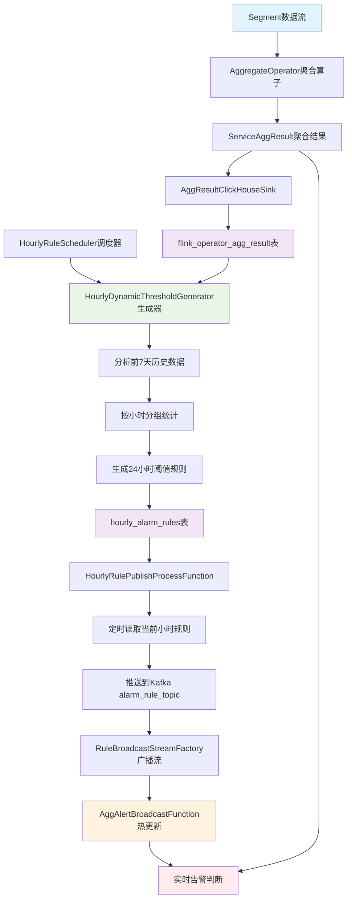

# 基于 flink_operator_agg_result 的小时级动态阈值生成流程总结

## 📋 概述

本文档详细记录了当前工程中通过统计 `flink_operator_agg_result` 表中历史汇总交易信息，并按小时进行信息汇总生成告警阈值的完整技术流程。该系统实现了从历史数据分析到实时告警的智能化闭环，具备小时级精度的差异化阈值策略。

## 🏗️ 整体架构流程图



## 🗄️ 1. 数据收集阶段

### 核心表结构：flink_operator_agg_result

```sql
CREATE TABLE flink_operator_agg_result (
    window_start  DateTime64(3),     -- 窗口起始时间
    windowSize    Int32,             -- 窗口大小（秒）
    operator_class String,           -- 算子类全名  
    operator_name String,            -- 算子类名
    service       String,            -- 服务名
    avg_duration  Float64,           -- 平均耗时
    max_duration  Int64,             -- 最大耗时
    error_rate    Float64,           -- 错误率
    total_count   Int64,             -- 总调用次数
    error_count   Int64,             -- 错误调用次数
    success_count Int64              -- 成功调用次数
    -- 其他字段...
) ENGINE = MergeTree()
ORDER BY (window_start);
```

### 数据写入流程

1. **数据源**：Flink消费Kafka中的Segment数据流
2. **聚合处理**：`AggregateOperator` 对原始数据进行窗口聚合（默认22秒窗口）
3. **结果对象**：生成 `ServiceAggResult` 聚合结果对象
4. **持久化**：通过 `AggResultClickHouseSink` 写入ClickHouse的 `flink_operator_agg_result` 表

### 关键代码组件

- **聚合算子**：`com.o11y.stream.operator.aggregate.AggregateOperator`
- **结果模型**：`com.o11y.domain.model.aggregation.ServiceAggResult`
- **数据写入**：`com.o11y.stream.sink.AggResultClickHouseSink`

## 📈 2. 数据分析与阈值生成阶段

### 核心组件

- **调度器**：`HourlyRuleScheduler` - 负责启动规则生成任务
- **生成器**：`HourlyDynamicThresholdGenerator` - 实现智能阈值算法

### 分析SQL查询

```sql
SELECT 
    toHour(window_start) as hour_of_day,  -- 按小时分组 (0-23)
    service, 
    operator_name,
    operator_class,
    -- 基础统计指标
    avg(avg_duration) as avg_avg_duration,
    avg(max_duration) as avg_max_duration, 
    avg(error_rate) as avg_error_rate,
    avg(total_count) as avg_total_count,
    count(*) as sample_count,
    -- 标准差（用于动态阈值计算）
    stddevSamp(avg_duration) as avg_duration_std,
    stddevSamp(max_duration) as max_duration_std,
    -- 分位数（用于更精准的阈值设定）
    quantile(0.75)(avg_duration) as avg_duration_p75,
    quantile(0.90)(avg_duration) as avg_duration_p90,
    quantile(0.95)(avg_duration) as avg_duration_p95
FROM flink_operator_agg_result 
WHERE window_start >= now() - INTERVAL ? DAY  -- 默认分析前7天
GROUP BY hour_of_day, service, operator_name, operator_class
HAVING sample_count >= ?  -- 保证样本充足性
ORDER BY hour_of_day, service, operator_name
```

### 智能阈值算法

#### 三级阈值计算策略

```java
// 小时级特征调整因子
HourlyAdjustmentFactor factor = getHourlyAdjustmentFactor(hourOfDay);

// 基于分位数 + 标准差的动态阈值
rule.avgDurationLow = max(P75 + 0.5*std*factor, avgDuration*1.1);
rule.avgDurationMid = max(P90 + 1.0*std*factor, avgDuration*1.3);  
rule.avgDurationHigh = max(P95 + 2.0*std*factor, avgDuration*1.8);
```

#### 小时特征识别

| 时段类型 | 小时范围 | 阈值策略 | 调整因子 |
|---------|---------|---------|---------|
| **高峰期** | 9-11, 14-16, 20-22点 | 阈值相对宽松 | factor > 1.0 |
| **低峰期** | 0-6点 | 阈值相对严格 | factor < 1.0 |
| **平峰期** | 其他时段 | 标准阈值 | factor = 1.0 |

#### 多维度阈值覆盖

1. **平均延迟阈值**：基于P75/P90/P95分位数
2. **最大延迟阈值**：识别慢请求异常
3. **成功率阈值**：监控服务可用性（低于阈值告警）
4. **交易量阈值**：检测流量激增（高于阈值告警）

## 🗃️ 3. 规则存储阶段

### 规则表结构：hourly_alarm_rules

```sql
CREATE TABLE hourly_alarm_rules (
    hour_of_day UInt8,               -- 小时序号 (0-23)
    service String,                  -- 服务名
    operator_name String,            -- 操作员名
    operator_class String,           -- 操作员类
    
    -- 多级阈值（高中低三档）
    avg_duration_low Float64,        -- 平均延迟低阈值
    avg_duration_mid Float64,        -- 平均延迟中阈值
    avg_duration_high Float64,       -- 平均延迟高阈值
    max_duration_low Float64,        -- 最大延迟低阈值
    max_duration_mid Float64,        -- 最大延迟中阈值
    max_duration_high Float64,       -- 最大延迟高阈值
    success_rate_low Float64,        -- 成功率低阈值
    success_rate_mid Float64,        -- 成功率中阈值
    success_rate_high Float64,       -- 成功率高阈值
    traffic_volume_low Float64,      -- 交易量低阈值
    traffic_volume_mid Float64,      -- 交易量中阈值
    traffic_volume_high Float64,     -- 交易量高阈值
    
    alarm_template String,           -- 告警模板
    analysis_days UInt8,             -- 分析的历史天数
    sample_count UInt32,             -- 样本数量
    generated_time DateTime,         -- 规则生成时间
    last_updated DateTime,           -- 最后更新时间
    version UInt32,                  -- 规则版本号
    
    PRIMARY KEY (hour_of_day, service, operator_name)
) ENGINE = MergeTree()
ORDER BY (hour_of_day, service, operator_name);
```

### 存储特点

- **完整覆盖**：每个服务+算子组合生成24条记录（每小时一条）
- **数据一致性**：支持批量清理和重新生成
- **元数据丰富**：包含样本数量、生成时间等便于运维调试
- **版本管理**：支持规则版本控制和回滚

## ⏰ 4. 定时下发阶段

### 核心组件：HourlyRulePublishProcessFunction

基于Flink的ProcessFunction + Timer机制实现精确的整点触发。

#### 工作流程

```java
// 每小时整点触发的核心逻辑
public void onTimer(long timestamp, OnTimerContext ctx, Collector<String> out) {
    int currentHour = LocalDateTime.now().getHour();
    
    // 1. 查询当前小时的所有规则
    Map<String, AlarmRule> ruleMap = loadHourlyRules(currentHour);
    
    // 2. 推送到Kafka实现热更新
    publishRulesToKafka(ruleMap, currentHour);
    
    // 3. 注册下一个小时的定时器
    long nextCheckTime = calculateNextCheckTime();
    ctx.timerService().registerProcessingTimeTimer(nextCheckTime);
}
```

#### 查询当前小时规则

```sql
SELECT service, operator_name, operator_class,
       avg_duration_low, avg_duration_mid, avg_duration_high,
       max_duration_low, max_duration_mid, max_duration_high,
       success_rate_low, success_rate_mid, success_rate_high,
       traffic_volume_low, traffic_volume_mid, traffic_volume_high,
       alarm_template
FROM hourly_alarm_rules 
WHERE hour_of_day = ?
```

#### 定时机制特点

- **精确触发**：基于Flink Timer的毫秒级精度
- **故障恢复**：支持Flink checkpoint和状态恢复
- **避免重复**：使用ValueState记录上次执行时间
- **自动循环**：每次执行后自动注册下次定时器

## 🔄 5. 热更新与实时告警阶段

### 广播流架构

#### Kafka Topic配置

**Topic**: `alarm_rule_topic`

**关键配置**：
```properties
# 启用Log Compaction策略
cleanup.policy=compact
min.cleanable.dirty.ratio=0.1
segment.ms=60000
delete.retention.ms=86400000
partitions=1
```

#### 消费策略

- **起始位置**：`earliest()` 确保启动时获取最新规则
- **消费组**：`alarm-rule-consumer-group` 固定消费组管理offset
- **并行度**：单并行度确保规则消费顺序性

### 广播流处理

#### RuleBroadcastStreamFactory

```java
// 构建规则广播流的核心方法
public static BroadcastStream<Map<String, AlarmRule>> buildRuleBroadcastStream(
        StreamExecutionEnvironment env,
        Map<String, String> kafkaConfig,
        MapStateDescriptor<String, Map<String, AlarmRule>> ruleStateDescriptor) {
    
    // 从Kafka构建数据源
    KafkaSource<Map<String, AlarmRule>> ruleSource = KafkaSource
        .<Map<String, AlarmRule>>builder()
        .setBootstrapServers(kafkaConfig.get("bootstrap_servers"))
        .setTopics(kafkaConfig.get("alarm_rule_topic"))
        .setGroupId(kafkaConfig.get("alarm_rule_group_id"))
        .setStartingOffsets(OffsetsInitializer.earliest())
        .setDeserializer(new AlarmRuleDeserializationSchema())
        .build();
    
    // 创建广播流
    return env.fromSource(ruleSource, WatermarkStrategy.noWatermarks(), "alarm-rule-source")
              .setParallelism(1)
              .filter(Objects::nonNull)
              .broadcast(ruleStateDescriptor);
}
```

#### AggAlertBroadcastFunction热更新

```java
// 实时告警判断的核心逻辑
public void processElement(ServiceAggResult value, ReadOnlyContext ctx, Collector<AlertMessage> out) {
    String key = value.getKey(); // service|operatorName
    Map<String, AlarmRule> ruleMap = ctx.getBroadcastState(ruleStateDescriptor).get("all_rules");
    
    if (ruleMap != null) {
        AlarmRule rule = ruleMap.get(key);
        if (rule != null) {
            AlertMessage alert = buildAlertReport(rule, value);
            out.collect(alert);
        }
    }
}

// 规则热更新处理
public void processBroadcastElement(Map<String, AlarmRule> ruleMap, Context ctx, Collector<AlertMessage> out) {
    // 使用固定key存储规则映射，实现热更新
    ctx.getBroadcastState(ruleStateDescriptor).put("all_rules", ruleMap);
    
    if (ruleMap != null && !ruleMap.isEmpty()) {
        LOG.info("[热更新] 收到新规则消息，规则总数：{}，keys：{}", 
                ruleMap.size(), ruleMap.keySet());
    }
}
```

### 告警级别判断

#### 多指标多级阈值分析

```java
// 平均延迟告警判断
if (rule.avgDurationHigh != null && value.avgDuration != null && 
    value.avgDuration > rule.avgDurationHigh) {
    conclusion.append("[HIGH] 平均延迟超过高阈值，建议立即排查服务性能瓶颈。\n");
    alertLevel = "HIGH";
    triggered = true;
} else if (rule.avgDurationMid != null && value.avgDuration != null && 
           value.avgDuration > rule.avgDurationMid) {
    conclusion.append("[MID] 平均延迟超过中阈值，建议关注服务近期变更。\n");
    alertLevel = "MID";
    triggered = true;
} else if (rule.avgDurationLow != null && value.avgDuration != null && 
           value.avgDuration > rule.avgDurationLow) {
    conclusion.append("[LOW] 平均延迟超过低阈值，建议持续观察。\n");
    alertLevel = "LOW";
    triggered = true;
}

// 成功率告警判断（低于阈值告警）
if (rule.successRateHigh != null && value.errorRate != null && 
    (1 - value.errorRate) < rule.successRateHigh) {
    conclusion.append("[HIGH] 成功率低于高阈值，建议立即排查异常原因。\n");
    alertLevel = "HIGH";
    triggered = true;
}

// 交易量告警判断（高于阈值告警）
if (rule.trafficVolumeHigh != null && value.totalCount != null && 
    value.totalCount > rule.trafficVolumeHigh) {
    conclusion.append("[HIGH] 交易量高于高阈值，建议关注流量激增原因。\n");
    alertLevel = "HIGH";
    triggered = true;
}
```

## 🎯 关键特性总结

### 1. 智能化阈值

- **多维算法**：结合分位数、标准差和小时特征的动态阈值
- **统计学基础**：使用P75/P90/P95分位数确保阈值的统计意义
- **自适应调整**：根据历史波动自动调整阈值敏感度

### 2. 小时级精度

- **业务感知**：识别高峰期、低峰期、平峰期的不同特征
- **差异化策略**：针对不同时段采用差异化阈值倍数
- **精确触发**：整点下发对应时段的专门规则

### 3. 零停机更新

- **Broadcast State**：基于Flink广播状态的分布式热更新
- **状态一致性**：确保所有并行实例同步更新规则
- **无中断服务**：规则更新过程中告警服务持续运行

### 4. 数据可靠性

- **Log Compaction**：Kafka压缩策略保证规则数据持久化
- **Earliest策略**：确保消费者启动时获取最新有效规则
- **故障恢复**：支持Flink checkpoint和自动恢复

### 5. 运维友好

- **完整日志**：每个环节都有详细的监控日志
- **状态管理**：支持规则版本控制和状态查询
- **异常处理**：完善的异常处理和降级机制

## 📊 性能与扩展性

### 数据量估算

- **历史数据**：分析前7天数据，支持千万级记录查询
- **规则数量**：每个服务-算子组合24小时规则，支持万级规则管理
- **实时处理**：毫秒级规则匹配，支持万级TPS实时告警

### 扩展能力

- **新指标扩展**：表结构和算法支持新监控指标
- **新算子接入**：统一的算子注册机制
- **多集群部署**：支持多数据中心和多环境部署

## 🔧 运维建议

### 监控指标

1. **规则生成监控**：监控每日规则生成成功率和耗时
2. **下发延迟监控**：监控规则从生成到生效的延迟
3. **告警准确性**：监控告警的准确率和误报率
4. **系统资源**：监控ClickHouse查询性能和Kafka延迟

### 调优建议

1. **样本数量调整**：根据业务量调整最小样本要求
2. **分析周期调整**：根据业务稳定性调整历史分析天数
3. **阈值敏感度**：根据告警效果调整阈值计算参数
4. **压缩策略优化**：根据规则更新频率优化Kafka压缩参数

---

## 📝 变更记录

| 版本 | 日期 | 变更内容 | 作者 |
|------|------|----------|------|
| 1.0 | 2024-12-19 | 初始版本，完整流程总结 | AI Assistant |

---

**文档状态**：✅ 当前版本  
**最后更新**：2024-12-19  
**适用版本**：当前工程主分支 